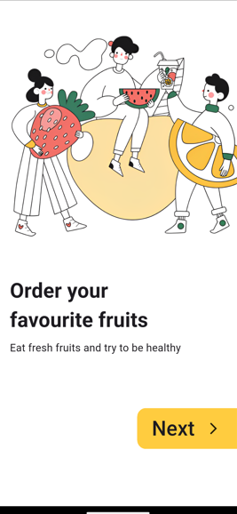
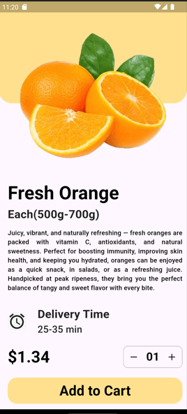

# E-Commerce UI Flutter App

A Flutter-based e-commerce mobile application featuring a modern grocery shopping interface with product listings, search functionality, and navigation between screens.

## Features

- **Home Screen**: Welcome interface with user greeting and product categories
- **Product Listings**: Horizontal scrollable product cards with images and pricing
- **Search Functionality**: Grocery search bar for easy product discovery
- **Navigation**: Seamless navigation between home and product detail screens
- **Responsive Design**: Optimized for mobile devices with clean UI

## Screenshots

### Landing Page


### Home Screen


### Details Page


## Project Structure

```
lib/
├── main.dart          # App entry point
├── home.dart          # Home screen with product listings
├── details.dart       # Product details screen
└── landing_page.dart  # Landing/welcome screen

images/
├── apple.png          # Product images
├── orange.png
├── boy.jpg           # User avatar
├── wave.png          # UI elements
├── landingpage.png
├── grocery1.jpg
└── grocery2.jpg
```

## Getting Started

### Prerequisites
- Flutter SDK (3.7.2 or higher)
- Android Studio or VS Code
- Android emulator or physical device

### Installation

1. Clone the repository:
```bash
git clone <repository-url>
cd E_COM_UI_REPO
```

2. Install dependencies:
```bash
flutter pub get
```

3. Run the app:
```bash
flutter run
```

### Running on Emulator

1. Start your Android emulator:
```bash
flutter emulators --launch Pixel_8_API_33
```

2. Run the app on emulator:
```bash
flutter run -d emulator-5554
```

## Supported Platforms

- ✅ Android
- ✅ Web
- ✅ Windows Desktop

## Dependencies

- `flutter`: SDK
- `cupertino_icons`: iOS-style icons
- `flutter_lints`: Code linting

## Contributing

Feel free to submit issues and enhancement requests!
